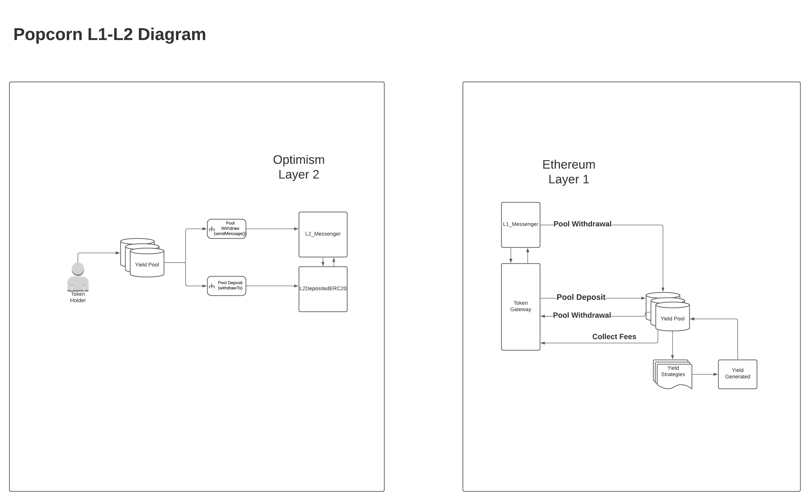

# Popcorn - Layer 2 Yield Optimizer using Optimism!

## Introduction

Popcorn removes all barriers to contributing to social good by offering yield optimizer contracts where the fees fund educational, environmental and open source initiatives.

In this project we make it simple to grow your crypto assets on Optimism, while harnessing the security and battle-tested  Ethereum Layer 1 yield farming strategies. You can have the best of both worlds! This project demonstrates how to leverage the low gas fees of Optimism to enter into and withdraw from layer 1 yield farming strategies.

Learn more about [Popcorn](https://popcorn.network).


## Technical Diagram



## Prerequisite Software

- [Git](https://git-scm.com/book/en/v2/Getting-Started-Installing-Git)
- [Node.js](https://nodejs.org/en/download/)
- [Yarn](https://classic.yarnpkg.com/en/docs/install#mac-stable)
- [Docker](https://docs.docker.com/engine/install/)

## Running the Example

Run the following commands to get started:

```sh
yarn
```

Make sure you have the local L1/L2 system running (open a second terminal for this):

```sh
git clone git@github.com:ethereum-optimism/optimism.git
cd optimism
yarn
yarn build
cd ops
docker-compose build
docker-compose up
```

Now run the deploy script:

```sh
lerna run deploy-example --parallel
```

If everything goes well, you should see something like the following:

```text
Deploying L1 mockDAI...
L1_mockDAI address:  0x99bbA657f2BbC93c02D617f8bA121cB8Fc104Acf
...
```

You'll need to copy the relevant addresses into a `.env` file in the project's root directory.

Now run the following to start the frontend and you are ready.

```sh
yarn lerna run start --parallel
```